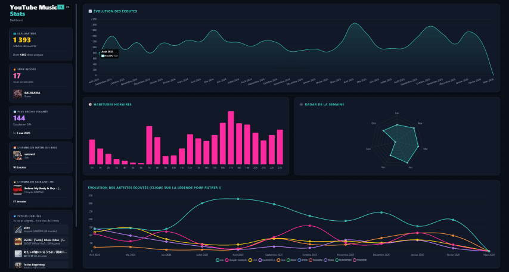
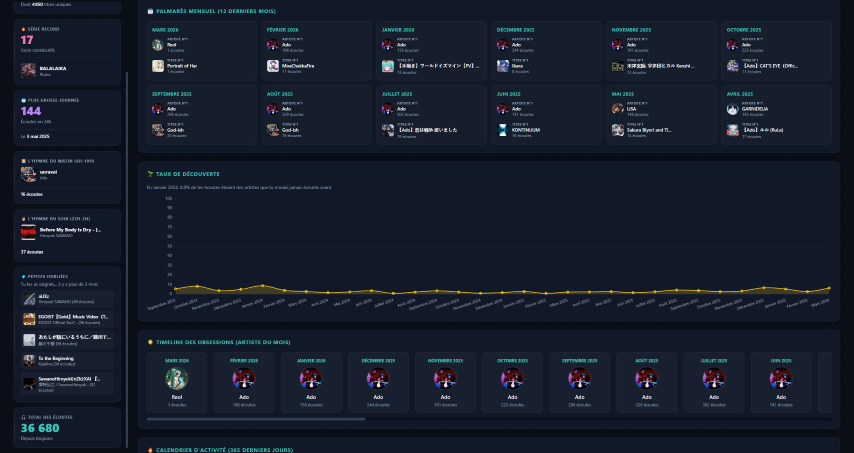
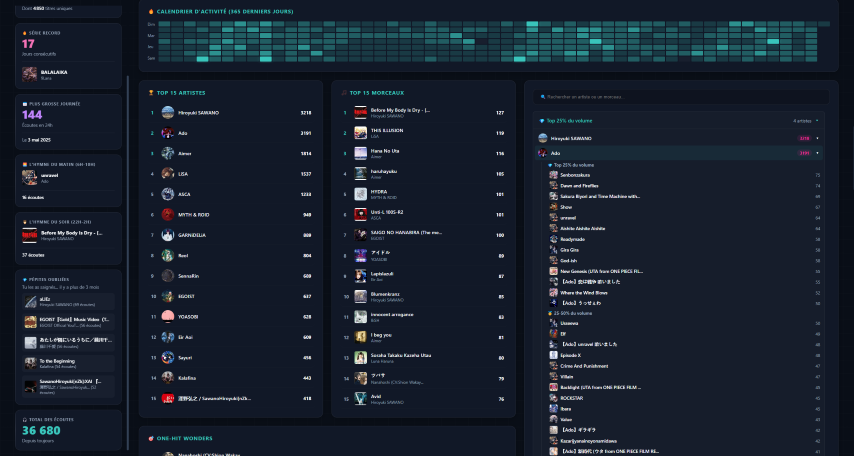

# YT Music Stats - Dashboard 🎵

Une application Electron qui génère des statistiques à partir de votre historique YouTube Music.

## Utilisation

Cette application peut être téléchargée sous deux formes depuis la section `Releases` :
- **Portable (.exe)** : Se lance directement sans installation.
- **Installeur (.exe)** : Installe le programme.

## 🛠️ Instructions : Comment Obtenir son fichier de données ? (Google Takeout)

Pour que ce Dashboard fonctionne, vous devez lui fournir l'historique de YouTube / Youtube Music.

1. Rendez-vous sur [Google Takeout](https://takeout.google.com/settings/takeout).
2. Cliquez sur **"Tout désélectionner"** dans la liste des données.
3. Descendez tout en bas jusqu'à trouver l'encart **"YouTube et YouTube Music"** et cochez la case.
4. Cliquez sur le bouton "formats multiples" et vérifiez que l'historique est configuré au format `HTML` ou `JSON`

> ⚠️ **Avertissement sur le format HTML :**
> L'export des données Google Takeout vous propose de télécharger l'historique sous format `.html` et `JSON`, L'historique du format `.html` remonte plus loin que le format `JSON` et est donc préférable , mais le parsing du format `.html` est plus long et l'application supporte uniquement les export pour les comptes dont la langue est configurée sur `Français`

5. Cliquez sur "toute les Youtube sont  Incluses" et décochez tout, **SAUF** "historique".
6. Cliquez sur "Étape suivante", choisissez "Exporter en une seule fois", créez l'export, et patientez pendant la génération. 
7. Vous recevrez un mail avec un lien de téléchargement de l'archive.
8. Extrayez le fichier History (`watch-history.json` ou `watch-history.html`) et glissez-déposez-le dans **YT Music Stats** !

## Compilation

### Prérequis
- `Node.js`
- `Git`.

### Étapes de compilation manuelle
1. Cloner ce répertoire : `git clone https://github.com/SamL-GIT/yt-music-stats-app.git`.
2. Installer les dépendances : `npm install`.
3. Lancer en local le mode développement : `npm start`.
4. Pour compiler l'application :
   - **Windows** (génère `.exe` portable et installeur) : `npm run dist:win`
   - **Linux** (génère `.AppImage`, *doit être exécuté depuis un environnement Linux/WSL*) : `npm run dist:linux`
5. Les fichiers compilés se trouveront dans le dossier `dist/`.
